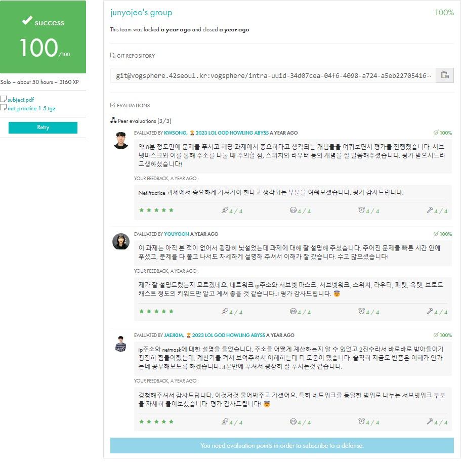

<div align="center">
  <h1>🌐 NetPractice</h1>
  <p>42Seoul의 네트워크 구성 학습 프로젝트</p>

  

  [](https://github.com/your-username/NetPractice)
</div>

## 📋 목차
1. [프로젝트 소개](#-프로젝트-소개)
2. [IP 주소](#-ip-주소)
3. [서브넷 마스크](#-서브넷-마스크)
4. [OSI 7계층](#-osi-7계층)
5. [네트워크 장비](#-네트워크-장비)
6. [문제 해결 가이드](#-문제-해결-가이드)
7. [참고 자료](#-참고-자료)

## 🎯 프로젝트 소개
NetPractice는 TCP/IP 주소 지정과 서브넷의 기본 개념을 학습하는 시스템 관리 프로젝트입니다. 웹 인터페이스를 통해 다양한 네트워크 구성 문제를 해결하며 실제 네트워크 설정 방법을 배웁니다.

### 주요 학습 목표
- IP 주소 체계 이해
- 서브넷 마스크 계산
- 네트워크/호스트 주소 구분
- 기본적인 네트워크 구성
- TCP/IP 프로토콜의 기초

## 📡 IP 주소

### 1. IP 주소 클래스
```
클래스 A: 255.0.0.0     (1-127)
클래스 B: 255.255.0.0   (128-191)
클래스 C: 255.255.255.0 (192-223)
```

### 2. 특수 목적 IP
```
- 루프백: 127.0.0.0 ~ 127.255.255.255
- 사설 IP:
  • 10.0.0.0 ~ 10.255.255.255 (10.0.0.0/8)
  • 172.16.0.0 ~ 172.31.255.255 (172.16.0.0/12)
  • 192.168.0.0 ~ 192.168.255.255 (192.168.0.0/16)
```

### 3. 예약된 주소
```
- 네트워크 주소: 호스트 부분이 모두 0
- 브로드캐스트 주소: 호스트 부분이 모두 1
- 예시:
  • 192.168.0.0   (네트워크 주소)
  • 192.168.0.255 (브로드캐스트 주소)
```

## 🎭 서브넷 마스크

### 1. 기본 개념
```
서브넷 마스크 비트    사용 가능한 호스트 수    서브넷 수
/24 (255.255.255.0)   254                     1
/25 (255.255.255.128) 126                     2
/26 (255.255.255.192) 62                      4
/27 (255.255.255.224) 30                      8
/28 (255.255.255.240) 14                      16
/29 (255.255.255.248) 6                       32
/30 (255.255.255.252) 2                       64
```

### 2. 서브넷 계산 예시
```
IP 주소: 192.168.123.71
서브넷 마스크: 255.255.255.192 (/26)

네트워크 주소 계산:
192.168.123.71 & 255.255.255.192 = 192.168.123.64

사용 가능한 호스트 범위:
192.168.123.65 ~ 192.168.123.126
```

## 🌐 OSI 7계층

### 1. 계층별 역할
```
7. 응용 계층 (Application)
   - 사용자 인터페이스
   - HTTP, FTP, SMTP

6. 표현 계층 (Presentation)
   - 데이터 형식 변환
   - 암호화/복호화

5. 세션 계층 (Session)
   - 연결 수립/유지/종료
   - 세션 관리

4. 전송 계층 (Transport)
   - 신뢰성 있는 전송
   - TCP, UDP

3. 네트워크 계층 (Network)
   - 경로 설정
   - IP, 라우터

2. 데이터링크 계층 (Data Link)
   - 물리적 주소 지정
   - MAC 주소, 스위치

1. 물리 계층 (Physical)
   - 비트 단위 전송
   - 케이블, 허브
```

### 2. 주요 프로토콜
```
응용 계층: HTTP, FTP, SMTP, DNS
전송 계층: TCP, UDP
네트워크 계층: IP, ICMP, ARP
데이터링크 계층: Ethernet
```

## 🔧 네트워크 장비

### 1. 라우터 (Router)
```
- 네트워크 계층(L3) 장비
- 서로 다른 네트워크 연결
- IP 주소 기반 라우팅
- 최적 경로 설정
```

### 2. 스위치 (Switch)
```
- 데이터링크 계층(L2) 장비
- 같은 네트워크 내 통신
- MAC 주소 기반 스위칭
- 충돌 도메인 분리
```

## 📘 문제 해결 가이드

### 1. IP 주소 설정 규칙
```
1. 같은 네트워크 내 장비들은 동일한 네트워크 주소를 가져야 함
2. 서브넷 마스크는 연속된 1로 구성되어야 함
3. 네트워크/브로드캐스트 주소는 호스트 주소로 사용 불가
4. 사설 IP 대역을 활용 (10.x.x.x, 172.16-31.x.x, 192.168.x.x)
```

### 2. 일반적인 문제 해결 순서
```
1. 네트워크 범위 확인
   - 주어진 서브넷 마스크로 네트워크 크기 파악
   - 사용 가능한 호스트 주소 범위 계산

2. 인터페이스 설정
   - 각 인터페이스에 적절한 IP 주소 할당
   - 서브넷 마스크 확인

3. 라우팅 설정
   - 게이트웨이 주소 확인
   - 라우팅 테이블 설정

4. 연결 테스트
   - 같은 네트워크 내 통신 확인
   - 다른 네트워크와의 통신 확인
```

### 3. 자주 하는 실수
```
- 서브넷 마스크 불연속 설정 (255.255.0.255)
- 네트워크/브로드캐스트 주소를 호스트 주소로 사용
- 서로 다른 네트워크에 같은 주소 할당
- 잘못된 게이트웨이 주소 설정
```

## 📚 참고 자료

### 1. 유용한 링크
- [chanheki-NetPractice](https://github.com/chanheki/NetPractice)
- [TCP/IP 통신 이해하기](https://int-i.github.io/cpp/2023-05-05/winsock2-tcp/)
- [OSI 7계층 상세 설명](https://www.cloudflare.com/ko-kr/learning/ddos/glossary/open-systems-interconnection-model-osi/)

### 2. 계산기
```
- IP 주소 계산기: ipcalc
- 서브넷 계산기: subnetcalc
- 온라인 도구: https://www.calculator.net/ip-subnet-calculator.html
```

### 3. 체크리스트
- [x] IP 주소 클래스 이해
- [x] 서브넷 마스크 계산
- [x] 네트워크/호스트 주소 구분
- [x] 라우팅 테이블 설정
- [x] TCP/IP 프로토콜 이해
- [x] OSI 7계층 구조 파악